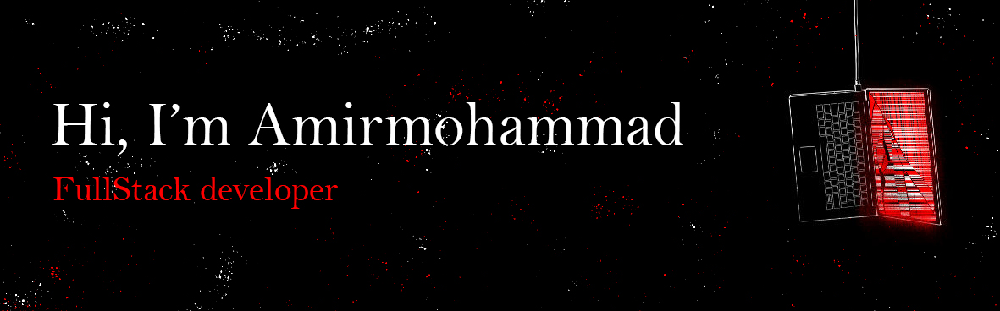

<h1 align="center">Hi 👋, I'm Amirmohammad Hassanabadi</h1>
<h3 align="center">A passionate fullstack developer from Iran</h3>

- 🌱 I’m currently learning **Typescript**

- 👨‍💻 All of my projects are available at [https://github.com/amirmohammadhassanabadi](https://github.com/amirmohammadhassanabadi)

- 📝 I regularly write articles on [medium](medium)

- 📫 How to reach me **hasanabadi.am@gmail.com**

- ⚡ Fun fact **I think i'm funny**

<h3 align="left">Connect with me:</h3>

# 💻 Tech Stack:
                                  

&nbsp;

